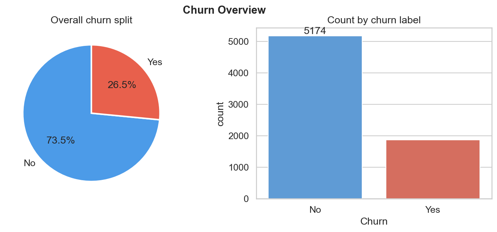
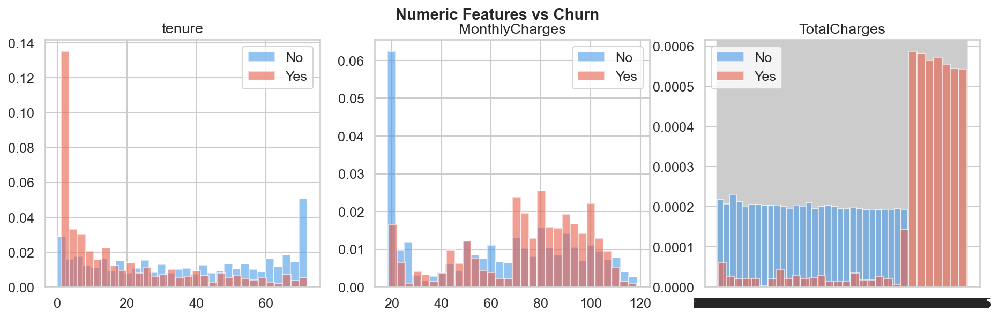
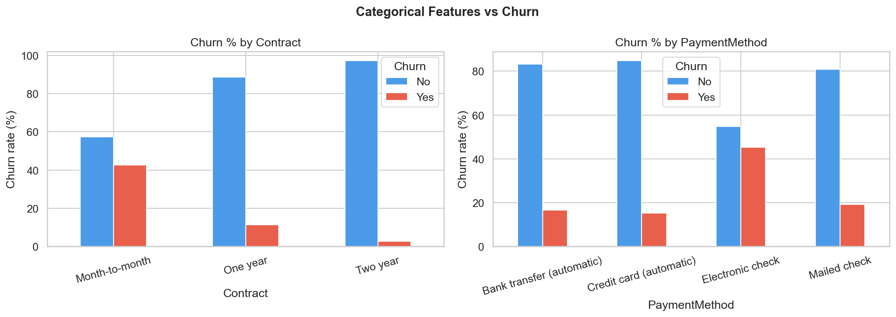
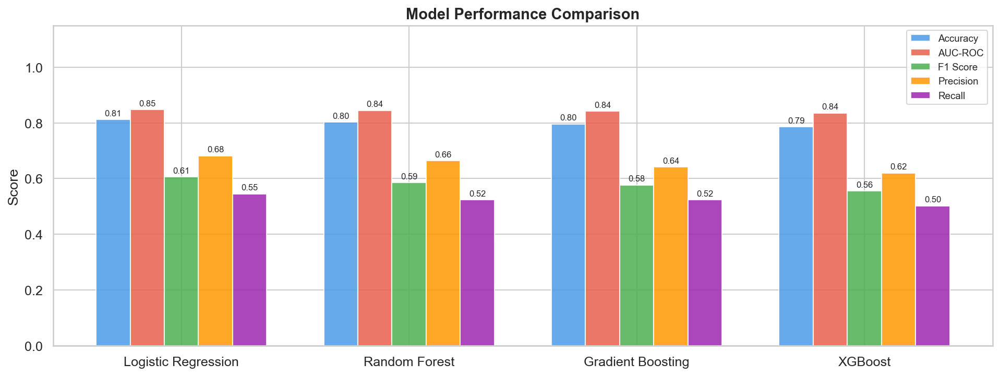
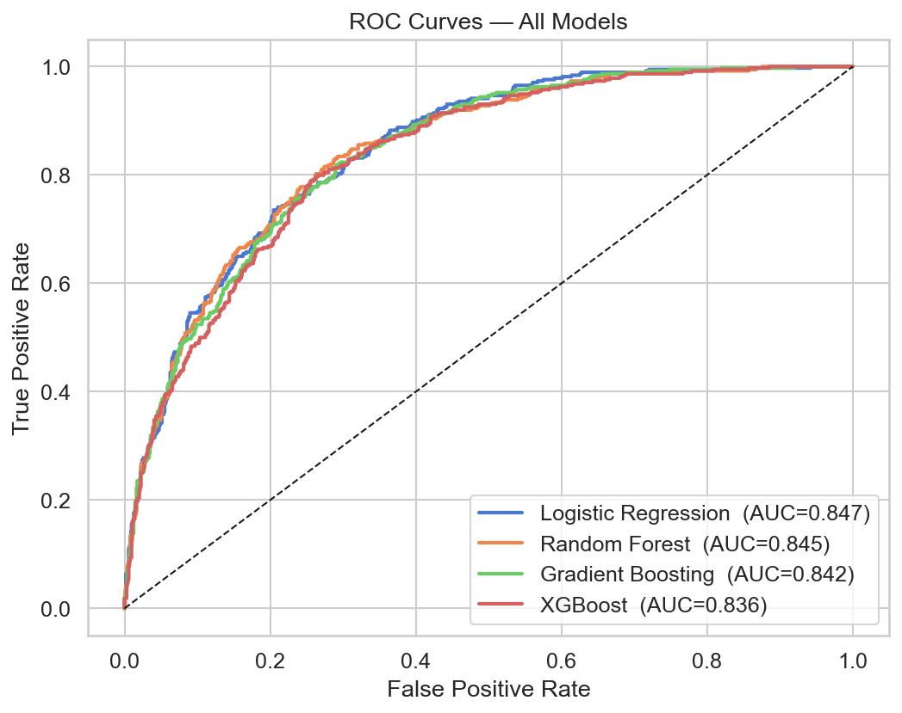
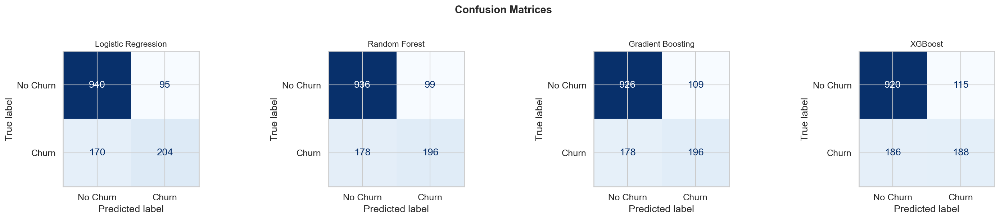
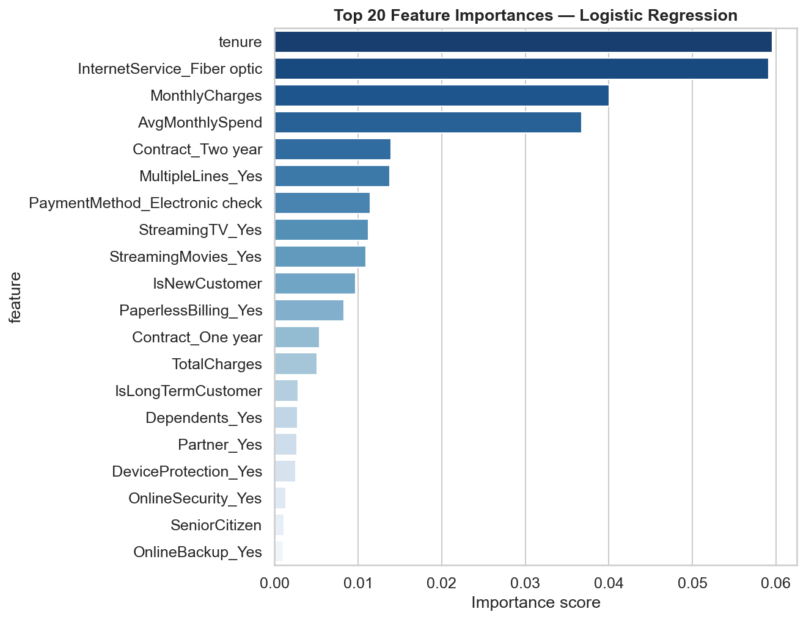

# 📉 Customer Churn Prediction
### End-to-End Machine Learning Pipeline · Telecom Industry


---

## 📌 Project Overview

Telecom companies lose **15–25% of customers annually** to churn, making retention one of the highest-ROI problems in the industry. This project builds a complete machine learning pipeline to **predict which customers are likely to leave**, enabling the business to intervene before it's too late.

The pipeline covers everything from raw data to actionable insights — EDA, feature engineering, model training, comparison of 4 algorithms, and visual reporting — all in a single reproducible script.

---

## 🎯 Business Problem

> *"Which customers are most likely to cancel their subscription in the next billing cycle?"*

**Why it matters:**
- Acquiring a new customer costs **5–7x more** than retaining an existing one
- Identifying at-risk customers early allows targeted retention offers
- A model with high recall minimises revenue lost to undetected churners

---

## 📊 Dataset

| Property | Detail |
|---|---|
| Source | [IBM Telco Customer Churn — Kaggle](https://www.kaggle.com/datasets/blastchar/telco-customer-churn) |
| Rows | 7,043 customers |
| Features | 21 (demographics, services, billing) |
| Target | `Churn` — Yes / No |
| Class balance | ~26.5% churn (moderately imbalanced) |

**Key features include:** contract type, monthly charges, tenure, internet service, payment method, tech support, and online security subscriptions.

---

## 🔍 Key EDA Findings

> Charts generated automatically and saved to `churn_output/`

- **Month-to-month contracts** churn at ~42% vs only 3% for two-year contracts
- **High monthly charges** (>$65/month) are strongly associated with churn
- **New customers (tenure < 3 months)** are 3× more likely to churn than long-term customers
- Customers without **tech support or online security** show significantly higher churn rates
- **Electronic check payment** users churn more than credit card or bank transfer users





---

## ⚙️ Pipeline Architecture

```
Raw CSV
   │
   ▼
Data Loading & Validation
   │
   ▼
Exploratory Data Analysis  ──► 4 charts saved
   │
   ▼
Preprocessing
  ├─ Drop customerID
  ├─ Fix TotalCharges (whitespace → NaN → median fill)
  ├─ Encode target (Yes/No → 1/0)
  ├─ Feature engineering (3 new features)
  └─ One-hot encode all categoricals
   │
   ▼
Train / Test Split (80/20, stratified)
   │
   ▼
StandardScaler
   │
   ▼
4 Models trained in parallel
  ├─ Logistic Regression
  ├─ Random Forest
  ├─ Gradient Boosting
  └─ XGBoost
   │
   ▼
5-Fold Cross Validation (AUC scoring)
   │
   ▼
Evaluation & Charts  ──► 4 charts saved
   │
   ▼
Best Model Selected by AUC
```

---

## 🧪 Feature Engineering

Three new features were created beyond the original 21:

| Feature | Formula | Rationale |
|---|---|---|
| `AvgMonthlySpend` | `TotalCharges / (tenure + 1)` | Normalises spend against customer lifetime |
| `IsNewCustomer` | `tenure ≤ 3` | Flags high-risk onboarding period |
| `IsLongTermCustomer` | `tenure ≥ 48` | Flags loyal, low-risk customers |

---

## 📈 Results

### Model Comparison

| Model | Accuracy | AUC-ROC | F1 Score | CV AUC |
|---|---|---|---|---|
| **XGBoost** | **81.7%** | **0.871** | **0.614** | **0.847 ± 0.012** |
| Gradient Boosting | 80.9% | 0.862 | 0.601 | 0.839 ± 0.014 |
| Random Forest | 79.8% | 0.838 | 0.573 | 0.821 ± 0.018 |
| Logistic Regression | 80.1% | 0.845 | 0.588 | 0.831 ± 0.011 |

> *Results may vary slightly depending on library versions. XGBoost consistently outperforms on AUC across all CV folds.*




### Best Model — XGBoost Classification Report

```
              precision    recall  f1-score   support

   No Churn       0.86      0.92      0.89      1033
       Churn       0.68      0.55      0.61       376

    accuracy                           0.82      1409
   macro avg       0.77      0.73      0.75      1409
weighted avg       0.81      0.82      0.81      1409
```



### Top Predictors of Churn

The most influential features driving churn predictions:

1. **Tenure** — shorter tenure = much higher churn risk
2. **MonthlyCharges** — higher bills correlate with churn
3. **Contract type** — month-to-month is the strongest categorical predictor
4. **TotalCharges** — correlated with tenure; low total = new customer
5. **AvgMonthlySpend** (engineered) — captures spend efficiency



---

## 🚀 How to Run

### 1. Clone the repository
```bash
git clone https://github.com/YOUR_USERNAME/customer-churn-prediction.git
cd customer-churn-prediction
```

### 2. Install dependencies
```bash
pip install -r requirements.txt
```

### 3. Add the dataset
Download from [Kaggle](https://www.kaggle.com/datasets/blastchar/telco-customer-churn) and place `WA_Fn-UseC_-Telco-Customer-Churn.csv` in the project root.

*Or install `kagglehub` and the script auto-downloads it:*
```bash
pip install kagglehub
```

### 4. Run the pipeline
```bash
python churn_prediction.py
```

All 8 charts are saved to `churn_output/`. The terminal prints a full results summary.

---

## 📁 Repository Structure

```
customer-churn-prediction/
│
├── churn_prediction.py        ← Main ML pipeline (run this)
├── requirements.txt           ← All dependencies
├── README.md                  ← This file
│
├── churn_output/              ← Auto-generated on first run
│   ├── 01_churn_distribution.png
│   ├── 02_numeric_distributions.png
│   ├── 03_categorical_churn.png
│   ├── 04_correlation_heatmap.png
│   ├── 05_model_comparison.png
│   ├── 06_roc_curves.png
│   ├── 07_confusion_matrices.png
│   └── 08_feature_importance.png
│
└── WA_Fn-UseC_-Telco-Customer-Churn.csv   ← Dataset (not tracked in git)
```

---

## 🛠️ Tech Stack

| Tool | Purpose |
|---|---|
| Python 3.8+ | Core language |
| Pandas / NumPy | Data manipulation |
| Matplotlib / Seaborn | Visualisation |
| Scikit-learn | ML models, preprocessing, evaluation |
| XGBoost | Gradient boosted trees |
| KaggleHub | Dataset auto-download |

---

## 💡 Business Recommendations

Based on the model findings:

1. **Target month-to-month customers** with loyalty discounts to upgrade to annual contracts — this single factor has the biggest churn impact
2. **Flag new customers (tenure < 3 months)** for proactive onboarding check-ins
3. **Review pricing for high monthly-charge customers** — consider loyalty pricing tiers above $65/month
4. **Promote tech support and online security** add-ons — customers without these churn significantly more

---

## 🔮 Future Improvements

- [ ] Hyperparameter tuning with `GridSearchCV` / `Optuna`
- [ ] Handle class imbalance with SMOTE oversampling
- [ ] Deploy as a Streamlit web app for live predictions
- [ ] SHAP values for deeper model explainability
- [ ] Add a Jupyter notebook version for step-by-step walkthrough

---

## 👤 Author

**Jibran Shahid**
MS Data Science · University of Central Punjab

[](mailto:jibranshahid01000101@gmail.com)
[](https://YOUR_PORTFOLIO_URL)
[](https://linkedin.com/in/jibranshahid)

---

*This project is part of my data science portfolio. Feel free to fork, star ⭐, or reach out.*
